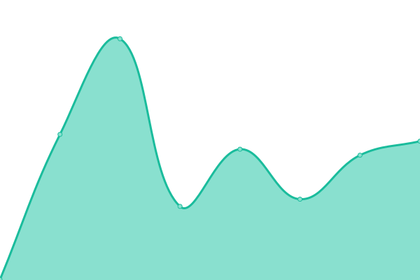

# [📈 Live Status](https://cybermindhive.github.io/upptime): <!--live status--> **🟧 Partial outage**

This repository contains the open-source uptime monitor and status page for [Andreas Huemer](https://cybermindhive.github.io/upptime), powered by [Upptime](https://github.com/upptime/upptime).

With [Upptime](https://upptime.js.org), you can get your own unlimited and free uptime monitor and status page, powered entirely by a GitHub repository. We use [Issues](https://github.com/cybermindhive/upptime/issues) as incident reports, [Actions](https://github.com/cybermindhive/upptime/actions) as uptime monitors, and [Pages](https://cybermindhive.github.io/upptime) for the status page.

<!--start: status pages-->
<!-- This summary is generated by Upptime (https://github.com/upptime/upptime) -->
<!-- Do not edit this manually, your changes will be overwritten -->
<!-- prettier-ignore -->
| URL | Status | History | Response Time | Uptime |
| --- | ------ | ------- | ------------- | ------ |
|  [bio10x.com](https://bio10x.com/) | 🟩 Up | [bio10x-com.yml](https://github.com/cybermindhive/upptime/commits/HEAD/history/bio10x-com.yml) | 

 1430ms
     
 | 

<a href="https://cybermindhive.github.io/upptime/history/bio10x-com">99.89%</a>
    

|  [cybermindhive.com](https://cybermindhive.com/) | 🟩 Up | [cybermindhive-com.yml](https://github.com/cybermindhive/upptime/commits/HEAD/history/cybermindhive-com.yml) | 

 1227ms
     
 | 

<a href="https://cybermindhive.github.io/upptime/history/cybermindhive-com">99.90%</a>
    

|  [run8.xyz](https://run8.xyz/) | 🟩 Up | [run8-xyz.yml](https://github.com/cybermindhive/upptime/commits/HEAD/history/run8-xyz.yml) | 

 1198ms
     
 | 

<a href="https://cybermindhive.github.io/upptime/history/run8-xyz">99.90%</a>
    

|  [thenannycollective.com.au](https://thenannycollective.com.au/) | 🟥 Down | [thenannycollective-com-au.yml](https://github.com/cybermindhive/upptime/commits/HEAD/history/thenannycollective-com-au.yml) | 

 2298ms
     
 | 

<a href="https://cybermindhive.github.io/upptime/history/thenannycollective-com-au">99.91%</a>
    

|  [thriveagain.com.au](https://www.thriveagain.com.au/) | 🟩 Up | [thriveagain-com-au.yml](https://github.com/cybermindhive/upptime/commits/HEAD/history/thriveagain-com-au.yml) | 

 246ms
     
 | 

<a href="https://cybermindhive.github.io/upptime/history/thriveagain-com-au">100.00%</a>
    

<!--end: status pages-->

[**Visit our status website →**](https://cybermindhive.github.io/upptime)

## 📄 License

- Powered by: [Upptime](https://github.com/upptime/upptime)
- Code: [MIT](./LICENSE) © [Anand Chowdhary](https://anandchowdhary.com), supported by [Pabio](https://pabio.com)
- Data in the `./history` directory: [Open Database License](https://opendatacommons.org/licenses/odbl/1-0/)
